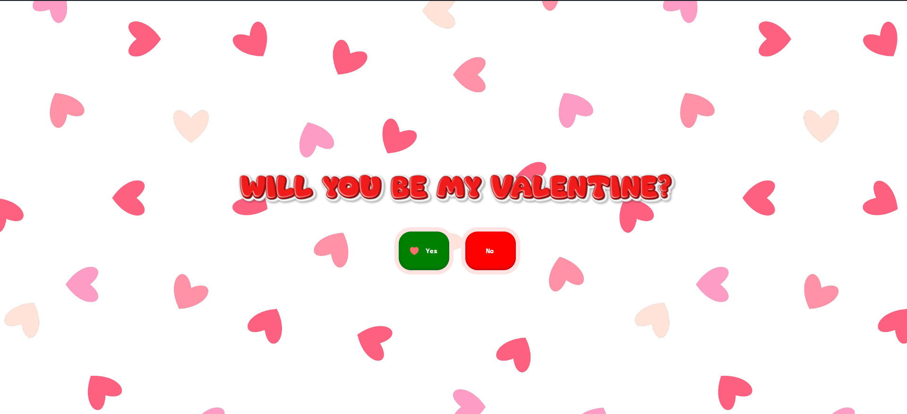

<p align="center">
  
</p>

# Valentine's Day 2024 Website 

This is a special website created to celebrate Valentine's Day in 2024. It's a place where you can share your love and affection with your loved ones in a unique and memorable way. The end also includes some Cat GIFs which will win over
anyone for Valentine's Day!

## Features 

* **Feature 1**: Buttons enlarge / reduce
* **Feature 2**: Buttons move around the screen
* **Feature 3**: Buttons shift away from the cursor
* **Feature 4**: Buttons disappear for short periods of time

## Preview 

A simple request for Valentine's Day!



## Credits 

Text Generator https://www.textstudio.com/

CSS Button https://uiverse.io/

## Installation 

Provide instructions on how to install and run your project locally.

```bash
# Clone this repository
git clone https://github.com/C-Teo/ValentineDay2024.git

# Go into the repository
cd ValentineDay2024

# Run ../html/index.html```